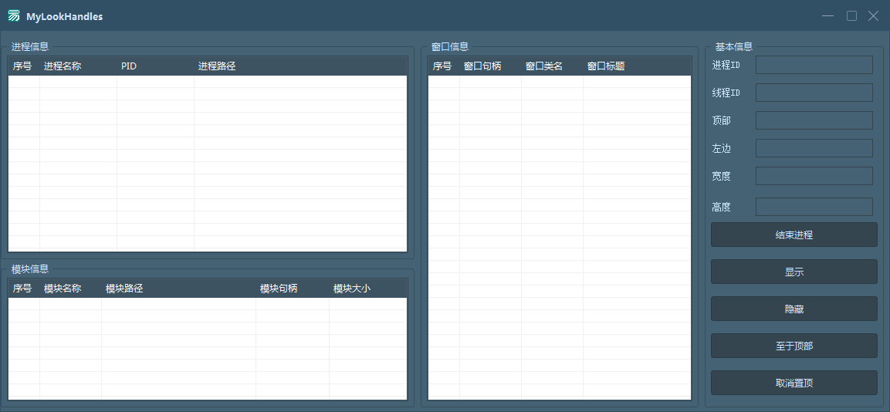
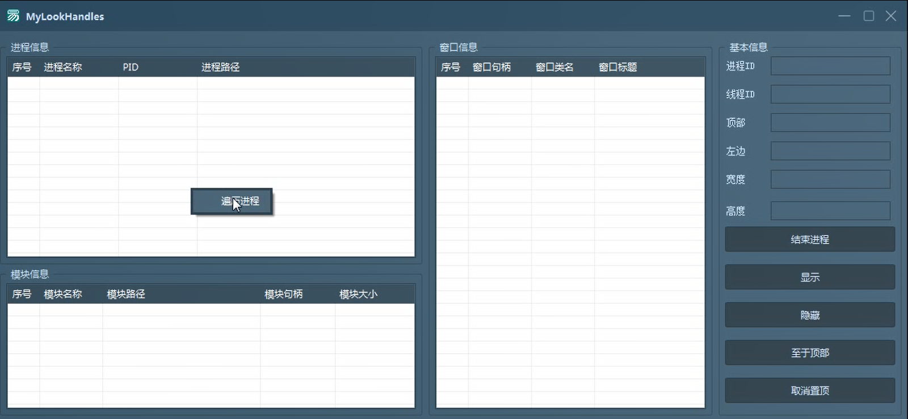
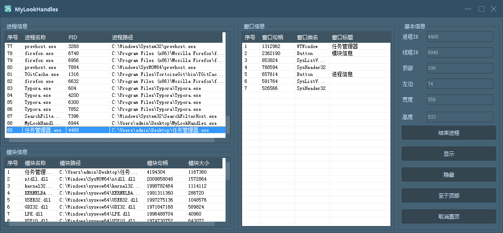

# MyLookHandles

> by tkzc00

# 简介

使用语言：易语言5.93

使用模块：

1. 精易模块[v11.1.5]
2. 华侨精绘皮肤模块4.3

软件功能：

1. 进程信息：进程名称、进程PID、进程路径
   1. 右键遍历系统进程
2. 模块信息：模块名称、模块路径、模块句柄、模块大小
   1. 双击进程项获取模块信息
3. 窗口信息：窗口句柄、窗口类名、窗口标题
   1. 双击进程项获取窗口信息
4. 基本信息
   1. 进程ID
   2. 线程ID
   3. 顶部距离
   4. 左边距离
   5. 窗口宽度
   6. 窗口高度
   7. 结束进程
   8. 显示窗口
   9. 隐藏窗口
   10. 窗口置顶
   11. 窗口取消置顶

# 软件截图

